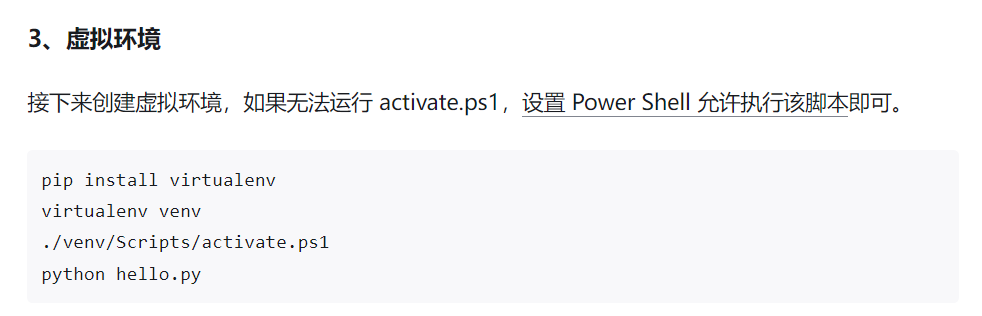

# NoGPT

### 一、环境

虚拟环境创建参考如下：

在Pycharm中创建虚拟环境，然后打开终端输入

`pip install -r requirements.txt`

pip下载streamlit库，终端输入

`pip install streamlit`

OCR文字识别配置如下：https://blog.csdn.net/m0_66979647/article/details/125358293

语音库安装配置如下：https://blog.csdn.net/alice_tl/article/details/89684369

### 二、运行

[网页版本]：打开终端，运行：

`streamlit run NoGPT.py`

[结果预测]：运行run.py文件即可

### 三、代码

- pyweb文件夹保存了streamlit网页配置的基本代码，包括图片和子页面
- model.py实现了核心算法
- model_gpu.py为实现核心算法的gpu版本代码
- model_web_gpu.py为实现核心算法并部署在网站上的gpu版本代码
- run.py为实验的运行文件
- run_web.py为在网站上跑实验的代码

